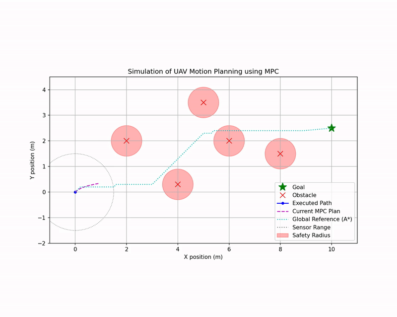
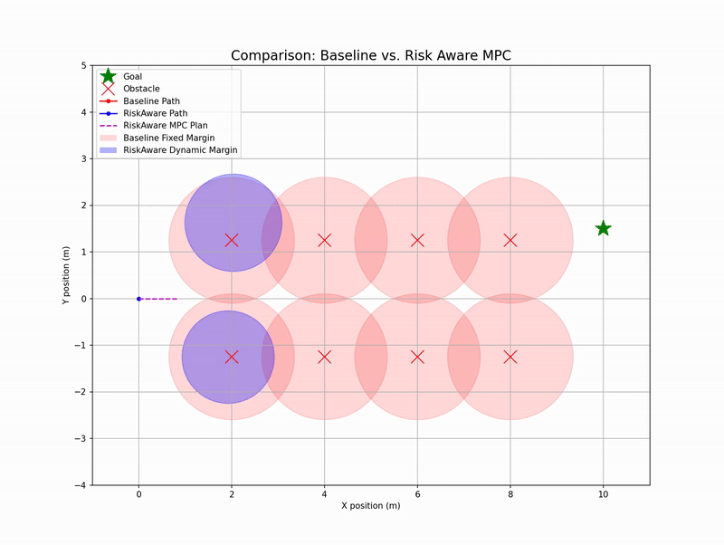

# Model Predictive Control for UAV Motion Planning with Risk-Aware Extension

This repository contains a Python implementation of a hierarchical motion planner for Unmanned Aerial Vehicles (UAVs), based on the concepts presented in the paper *"Model Predictive Control for Optimal Motion Planning of Unmanned Aerial Vehicles" by Bui et al. (2024)*. It also features a novel extension, a **Risk-Aware MPC**, designed to enhance the planner's performance and safety in environments with perception uncertainty.

## Table of Contents
1.  [Project Overview](#project-overview)
2.  [The Core Problem](#the-core-problem)
3.  [The Implemented Solution: A Hierarchical Planner](#the-implemented-solution-a-hierarchical-planner)
    *   [1. Perception Module](#1-perception-module)
    *   [2. Global Reference Planner (A*)](#2-global-reference-planner-a)
    *   [3. Local Optimal Planner (MPC)](#3-local-optimal-planner-mpc)
4.  [Novel Extension: Risk-Aware MPC](#novel-extension-risk-aware-mpc)
    *   [The Limitation of the Baseline](#the-limitation-of-the-baseline)
    *   [Our Probabilistic Solution](#our-probabilistic-solution)
    *   [Demonstrated Results](#demonstrated-results)
5.  [File Structure](#file-structure)
6.  [Setup and Usage](#setup-and-usage)
7.  [Acknowledgments](#acknowledgments)

## Project Overview

The primary goal of this project was to replicate and analyze the motion planning architecture proposed by *Bui et al. (2024)*. The system is designed to enable a UAV to navigate autonomously through a complex, unknown environment by processing local sensor data to generate smooth, safe, and dynamically feasible trajectories.

After a successful replication, we identified a key limitation in handling sensor noise and proposed a novel **Risk-Aware MPC** extension. This extension replaces the paper's deterministic safety constraints with a probabilistic, chance-constrained approach, leading to a planner that is both more efficient and more robust in realistic conditions.

## The Core Problem

Navigating a UAV in a cluttered, unknown environment requires solving a complex problem at every time step: "Given what I can see right now, what is the best sequence of actions to get me closer to my goal without crashing, while respecting my physical limits?"

This problem involves balancing multiple competing objectives:
-   **Safety:** Avoid collisions at all costs.
-   **Efficiency:** Make progress towards the goal.
-   **Smoothness:** Avoid jerky movements that are inefficient and unstable.
-   **Dynamic Feasibility:** Adhere to the UAV's real-world limits on velocity and acceleration.

## The Implemented Solution: A Hierarchical Planner

Our implementation follows the paper's hierarchical, two-phase architecture, which separates the problem into a long-term navigation task and a short-term control task.

### 1. Perception Module
The drone simulates a local range sensor. This module is responsible for detecting nearby obstacles and updating a local map of the environment. In our implementation, we model this as an **occupancy grid**, where cells are marked as "Free," "Occupied," or "Unknown."

### 2. Global Reference Planner (A*)
Using the local occupancy grid from the perception module, a high-level pathfinding algorithm (we use A*, a close relative of the paper's JPS) finds the shortest, collision-free path from the drone's current position to the goal. This path is often jagged and not dynamically feasible, but it serves as an intelligent "suggestion" or **global reference** for the next stage.

### 3. Local Optimal Planner (MPC)
This is the core of the system. The Model Predictive Controller takes the jagged global reference path as a guide and formulates a non-linear optimization problem to find the *best possible* trajectory over a short future horizon (e.g., 2 seconds). It minimizes a cost function that balances:
-   **Tracking Cost:** Penalty for deviating from the A* path.
-   **Speed Cost:** Penalty for not maintaining a target speed.
-   **Collision Cost:** A massive penalty for getting too close to detected obstacles.
-   **Jerk Cost:** Penalty for unsmooth, aggressive maneuvers.

This optimization is solved at every time step to produce a smooth, safe, and flyable local plan. The drone executes the first step of this plan, and the entire process repeats.

<p align="center">
  
</p>

## Novel Extension: Risk-Aware MPC

### The Limitation of the Baseline
The baseline planner assumes sensor data is perfect. To be safe in the real world where sensors are noisy, it must use a large, fixed "worst-case" safety margin around all detected obstacles. Our experiments showed that this "timid" strategy causes the planner to see safe corridors as blocked, leading to highly inefficient or failed paths.

### Our Probabilistic Solution
Our extension replaces this fixed margin with an intelligent, **dynamic safety margin**.
1.  **Uncertainty Modeling:** We treat each noisy obstacle detection not as a point, but as a **Gaussian probability distribution**.
2.  **Chance Constraints:** We define a maximum acceptable risk (e.g., 1% probability of collision).
3.  **Dynamic Margin Calculation:** At each step, the MPC calculates the required safety margin needed to satisfy the risk constraint, based on the drone's viewing angle and the obstacle's uncertainty. This margin grows when uncertainty is high and shrinks when the drone is more confident, allowing it to navigate more aggressively and efficiently.

### Demonstrated Results
In a simulated "corridor" race with anisotropic sensor noise, our Risk-Aware MPC demonstrated a **~12% improvement in finish time** and a **~20% reduction in control effort** compared to the conservatively tuned baseline. This proves that by explicitly reasoning about uncertainty, our method achieves superior performance and efficiency.

<p align="center">
  
</p>

## File Structure

The repository is organized as follows:
```
├── output/
│ └── .mp4 # Folder for saved simulation videos
├── main_simulation.py # Main script for the original replication
├── run_comparison.py # Main script for the novel extension experiment
├── mpc_optimizer.py # Contains the core MPCOptimizer and PerceptionModule classes
├── reference_planner.py # Contains the ReferencePlanner (Grid Map + A*)
├── risk_aware_optimizer.py # Contains the RiskAwareMPCOptimizer subclass (our novelty)
├── record_sim.py # (Legacy) - Video recording is now integrated
└── README.md
```

## Setup and Usage

This project is written in Python 3.13.5 and its dependencies are managed via a Conda environment.

**1. Clone the repository:**

```bash
    git clone https://github.com/Charukhesh/UAVMotionPlanning_MPC.git
    cd UAVMotionPlanning_MPC
```

**2. Create and activate the Conda environment:**

This will create a new, isolated Python environment named `UAV_MP` with the Python version.
```bash
    conda create --name UAV_MP python=3.13.5
    conda activate UAV_MP
```

**3. Install dependencies:**

Install all the required packages from the requirements.txt file using pip.
```bash
    pip install -r requirements.txt
```

**3. Run the main experiment:**

To run the baseline paper's simulation, execute::
```bash
    python main_simulation.py
```

To run the comparative simulation and reproduce the results of our novel extension, execute:
```bash
    python run_comparison.py
```

A real-time plot will show the simulation, and a video of the simulation will be saved in the output/ directory.

## Acknowledgments

This project is a replication of and extension to the excellent work presented in the following paper. All credit for the foundational methodology, system architecture, and core concepts goes to the original authors.

```
D.-N. Bui, T. H. Khuat, M. D. Phung, T.-H. Tran, D. L. T. Tran, "Model Predictive Control for Optimal Motion Planning of Unmanned Aerial Vehicles," 2024
```